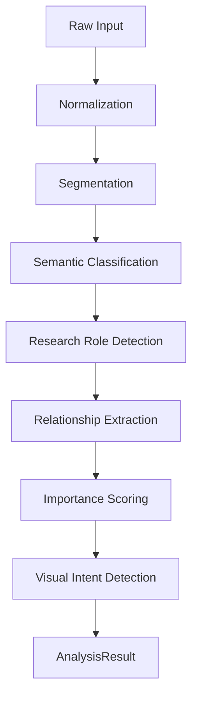

# Content Intelligence Pipeline

## 1. Purpose
Mendefinisikan pipeline sistematis untuk mengubah input mentah menjadi graf semantik terstruktur (`AnalysisResult`), tanpa melibatkan keputusan tata letak (layout) atau desain.

## 2. Conceptual Model

## 3. Tahapan Pipeline

### A. Input Normalization
- **Purpose**: Membersihkan teks dan menstandarkan format tanpa merusak makna.
- **Rules**: Tidak boleh meringkas (summarize). Deteksi tabel, code block, formula.
- **Failure**: Jika output kosong, bangkitkan `NormalizationError`.

### B. Segmentation
- **Purpose**: Memecah dokumen menjadi `ContentUnit` terurut berdasar hierarki heading, paragraf, dan daftar.
- **Rules**: Mempertahankan `source_order` dan `parent_id` (relasi heading-to-body).
- **Output**: Array `ContentUnit` dengan tipe struktural awal (contoh: `TITLE`, `SEQUENCE`).

### C. Semantic Classification
- **Purpose**: LLM menentukan `content_type` umum (contoh: `EXPLANATION`, `COMPARISON`).
- **Input Contract**: Unit teks + konteks sebelum/sesudah.
- **Output Contract**: `AIClassificationOutput`.

### D. Research Role Detection
- **Purpose**: Khusus jika `document_genre == RESEARCH_REPORT`, menentukan peran KTI (contoh: `RESEARCH_FINDING`, `RESEARCH_METHOD`).
- **Rules**: Mencegah peleburan (collapse) antara `DATA` dan `INTERPRETATION`.

### E. Relationship Extraction
- **Purpose**: Membangun graf keterlacakan (contoh: Kesimpulan menjawab Rumusan Masalah).
- **Output Contract**: Array `ContentRelationship`.

### F. Importance Scoring
- **Purpose**: Menghitung bobot kepentingan presentasi.
- **Algoritma**: Heuristik deterministik berdasarkan depth (struktur), bobot semantik, dan sentralitas relasi (tidak membebani LLM).

### G. Visual Intent Detection
- **Purpose**: Mengusulkan jenis visualisasi logis (`TEXT_FOCUSED`, `COMPARATIVE`).
- **Rules**: Tidak mengeluarkan spesifikasi CSS/HTML.

## 4. Error Handling
Jika LLM gagal di tahap C, D, E, atau G, sistem menggunakan mekanisme retry dan struktur perbaikan yang diatur oleh `OutputValidator`. Jika gagal total, fallback ke mode degradasi.
