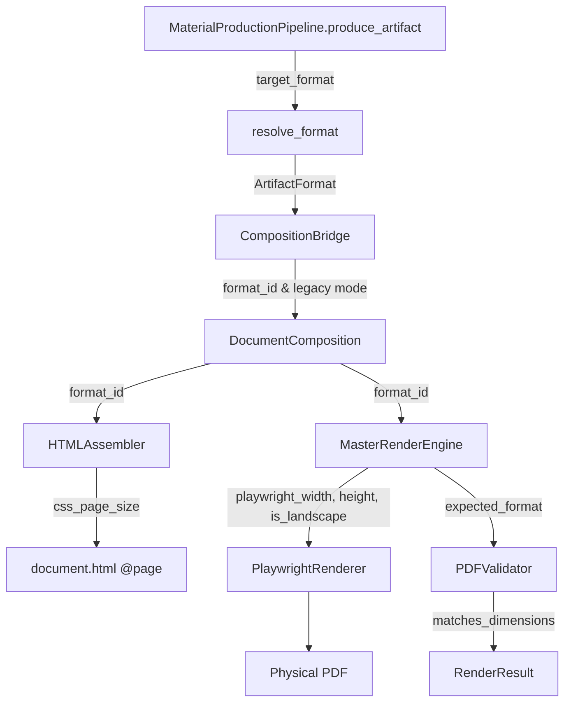

# Artifact Format Contract & Layout Specification Architecture (Batch 7.8)

## 1. Core Architectural Principle

```
SEMANTIC INTENT ≠ PEDAGOGICAL MODE ≠ PHYSICAL OUTPUT FORMAT
```

In KIR AI Document Intelligence, document creation is strictly decoupled across three distinct layers of responsibility:

```
┌─────────────────────────────────────────────────────────────────┐
│ 1. SEMANTIC INTENT                                              │
│ What is being created? What knowledge is communicated?          │
│ (e.g. Physics Torque, KTI Problem Funnel, Research Hypothesis)  │
└────────────────────────────────┬────────────────────────────────┘
                                 │
                                 ▼
┌─────────────────────────────────────────────────────────────────┐
│ 2. PEDAGOGICAL / NARRATIVE MODE                                 │
│ How should the narrative sequence unfold pedagogically?         │
│ (e.g. Phenomenon → Concept → Worked Example → Misconception)    │
└────────────────────────────────┬────────────────────────────────┘
                                 │
                                 ▼
┌─────────────────────────────────────────────────────────────────┐
│ 3. PHYSICAL FORMAT CONTRACT (Single Source of Truth)            │
│ What physical canvas geometry and constraints are used?         │
│ (e.g. a4_portrait, a4_landscape, presentation_16_9)            │
└────────────────────────────────┬────────────────────────────────┘
                                 │
                                 ▼
┌─────────────────────────────────────────────────────────────────┐
│ 4. COMPOSITION & DESIGN ADAPTATION                              │
│ How do components flow into regions given available space?     │
└────────────────────────────────┬────────────────────────────────┘
                                 │
                                 ▼
┌─────────────────────────────────────────────────────────────────┐
│ 5. HYBRID RENDERING (Jinja2 HTML + SVGs + Playwright Chromium)  │
│ Validated PDF output matching canonical format bounds           │
└─────────────────────────────────────────────────────────────────┘
```

---

## 2. Authoritative Format Registry

Located at [`app/formats/`](file:///home/si/Codingan/Mencari%20nafkah/Mengajar/app/formats/):

| Canonical Format ID | Display Name | Canonical Dimensions | Typographic Points | Orientation | Category |
|---|---|---|---|---|---|
| `a4_portrait` | A4 Portrait | `210.0 × 297.0 mm` | `595.28 × 841.89 pt` | Portrait | Document / Handout |
| `a4_landscape` | A4 Landscape | `297.0 × 210.0 mm` | `841.89 × 595.28 pt` | Landscape | Document / Tutorial / Poster |
| `presentation_16_9` | Presentation 16:9 | `338.67 × 190.5 mm` (`13.333 × 7.5 in`) | `960.0 × 540.0 pt` | Landscape | Slide Presentation |

### Aliases Handled Deterministically:
- `16:9`, `16_9`, `presentation`, `presentation-16-9` → `presentation_16_9`
- `a4`, `portrait`, `a4-portrait`, `a4_handout` → `a4_portrait`
- `landscape`, `a4-landscape`, `a4-tutorial`, `a4_tutorial` → `a4_landscape`

---

## 3. Format Resolution Precedence

When a production request is processed, the physical format is resolved via [`app/formats/resolution.py`](file:///home/si/Codingan/Mencari%20nafkah/Mengajar/app/formats/resolution.py) according to strict precedence:

1. **Explicit Request Override:** Caller explicitly supplies `target_format` (e.g. `"a4_landscape"` or `ArtifactFormat`).
2. **Artifact Default Recommendation:** If not specified, default mapped from `TargetArtifactType`:
   - `TEACHING_PRESENTATION` / `RESEARCH_PRESENTATION` → `presentation_16_9`
   - `DETAILED_HANDOUT` / `KTI_DOCUMENT` / `STUDENT_WORKSHEET` / `ONE_PAGE_SUMMARY` → `a4_portrait`
   - `SCIENTIFIC_POSTER` → `a4_landscape`
3. **Safe System Fallback:** `A4_PORTRAIT`.

---

## 4. Propagation Across the Stack



### Responsibility Boundaries:
- **`app/formats/`:** Owns geometry, orientation, CSS `@page` rule, and Playwright parameters.
- **`app/composition/`:** Consumes resolved `ArtifactFormat`, maps sequence to regions, embeds `format_id` in metadata.
- **`app/rendering/html/`:** Embeds canonical `@page` size from `ArtifactFormat.css_page_size`.
- **`app/rendering/playwright/`:** Renders PDF using canonical width/height and landscape flag.
- **`app/rendering/validation/`:** Compares output PDF page rect against `ArtifactFormat` with tolerance.

---

## 5. Backward Compatibility
- Existing legacy `DocumentMode` enum values (`A4_PORTRAIT`, `A4_LANDSCAPE`, `A4_TUTORIAL`, `PRESENTATION_16_9`) continue to resolve cleanly to canonical `ArtifactFormat` presets.
- Existing tests and callers that do not specify `target_format` automatically use the documented default recommendations without breaking.
- Legacy `final.pdf` copy is retained alongside contextual `<slug>.pdf`.
