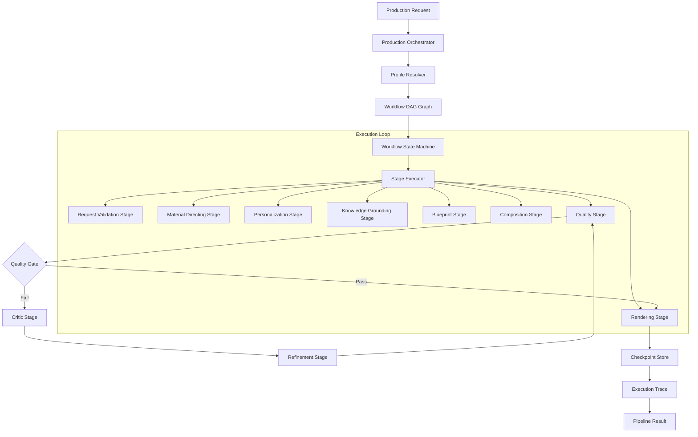

# Orchestration Architecture

This document describes the orchestration control plane coordinating the document production lifecycle.

## Architecture Topology

## Key Invariants
- **Control Plane Decoupling**: Subsystems (intelligence, composition, rendering) are isolated. Stage adapters interface with them without absorbing logic.
- **Topological Stage Validation**: The system validates node ordering and dependencies before execution begins.
- **Graceful Failures**: Standardized failure tracking prevents unhandled crashes.
