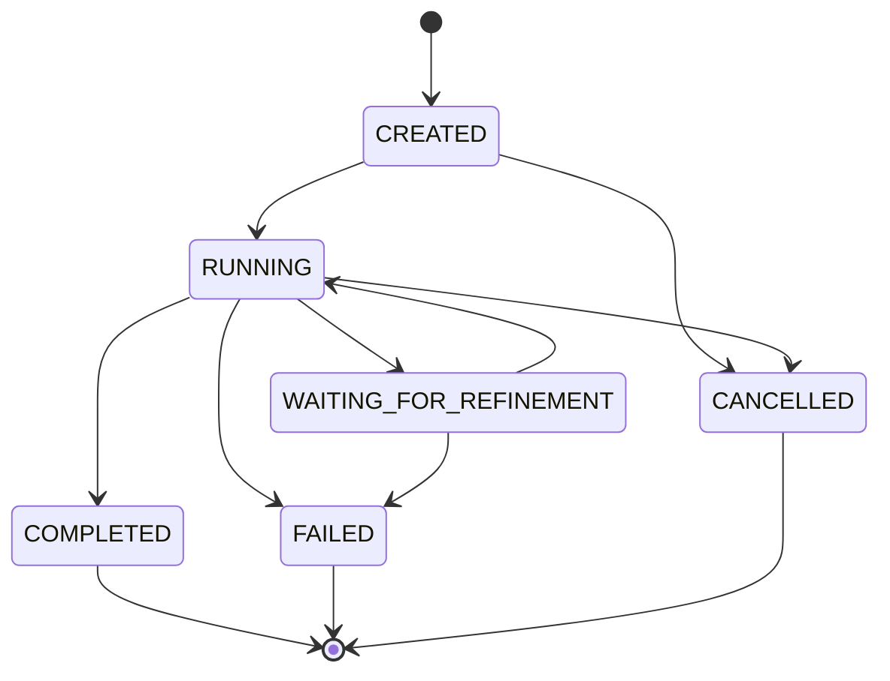

# Execution State Machine

This document details the lifecycles, states, and transition graphs.

## Job State Machine
A production job progresses through the following transitions:

## Stage State Transitions
Individual execution nodes transitively progress via:
- `PENDING` -> `READY`, `SKIPPED`, `BLOCKED`
- `READY` -> `RUNNING`, `SKIPPED`, `BLOCKED`
- `RUNNING` -> `SUCCEEDED`, `FAILED`, `RETRYING`, `SKIPPED`
- `RETRYING` -> `RUNNING`, `FAILED`

Illegal state transitions raise explicit validation errors.
Downstream required stages transition to `BLOCKED` recursively if an upstream dependency fails.
