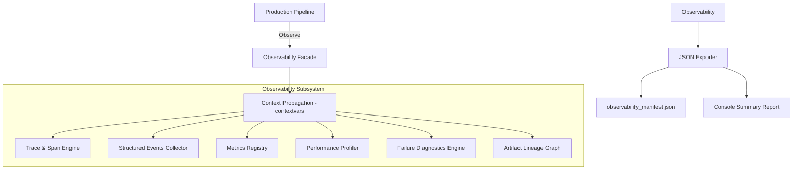

# Observability Architecture

This document describes the design of the decoupled Observability Subsystem for the KIR AI Document Generation Engine.

## Subsystem Architecture Topology

## Architectural Design Rules
1. **Orthogonal Operation**: Observability records execution parameters and latency, but never overrides/interferes with pipeline routing decisions or business logic.
2. **Minimal Dependency**: Observability modules are independent of content engines, formats, or renderers.
3. **Safe Exception Handling**: Failures inside telemetry collection do not propagate upwards to abort document generation runs.
4. **Conditional Overhead**: The system can be entirely bypassed via configuration variables, returning negligible runtime impact.
