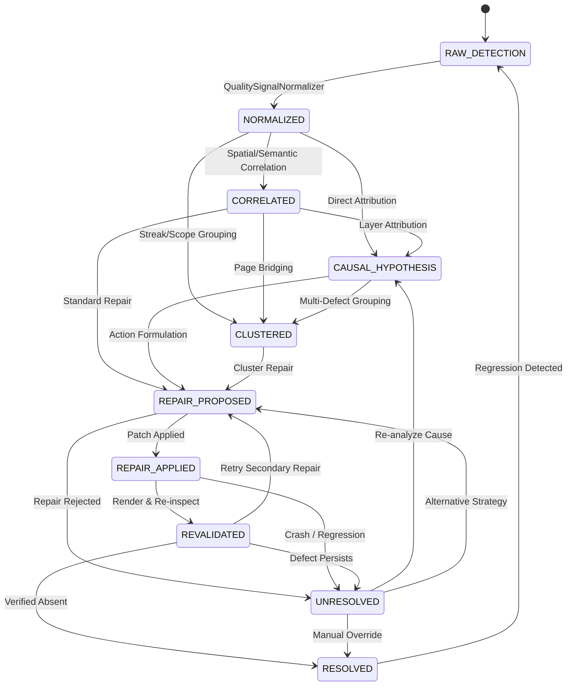

# PHASE 3A.2 — CANONICAL QUALITY INTELLIGENCE CONTRACT
## Universal Document Intelligence System V5

---

## 1. Executive Summary & Architectural Position

Phase 3A.2 establishes the shared, immutable, type-safe **Canonical Quality Intelligence Contract** for the Universal Document Intelligence System V5.

Historically, quality signals, defect codes, and thresholds evolved across disparate subsystems:
- Phase 2B validated structural fidelity and element conservation.
- Phase 2C introduced adversarial semantic scoring and blueprint calibration.
- Phase 3A engineered independent physical rendered output inspection (PyMuPDF geometry, raster variance, font metrics).
- Phase 3A.1 began consolidating quality decision authority and root cause attribution.

Phase 3A.2 sits directly between physical inspection (Phase 3A) and automated repair execution (Phase 3B). It formalizes an immutable contract boundary so that:
1. Every defect signal represents **pure detection** without conflating symptom with cause.
2. Evidence references are machine-readable and mathematically grounded.
3. Every signal is strictly tracked across a 10-state lifecycle state machine.
4. Repair proposals and transactions are standardized before any repair engine executes changes.

```
+---------------------------------------------------------------------------------------------------+
|                                 PIPELINE TRANSFORMATION FLOW                                      |
+---------------------------------------------------------------------------------------------------+
|  SOURCE -> Knowledge Compiler -> Blueprint Transformer -> Controlled Renderer -> Physical PDF/DOM |
+---------------------------------------------------------------------------------------------------+
                                                      |
                                                      v
                                        [ PHASE 3A: Physical Inspection ]
                                                      |
                                                      v
                                  +---------------------------------------+
                                  |  PHASE 3A.2: CANONICAL QUALITY        |
                                  |              INTELLIGENCE CONTRACT    |
                                  |  - QualitySignal (Detection Only)     |
                                  |  - QualityLocation (All 4 Formats)    |
                                  |  - EvidenceReference (Geometry/Data)  |
                                  |  - SignalLifecycleStateMachine        |
                                  |  - ScopePolicy (Format Calibrated)    |
                                  |  - RepairProposal & Transaction       |
                                  +---------------------------------------+
                                                      |
                                                      v
                                   [ PHASE 3A.1: Causal Attribution ]
                                                      |
                                                      v
                                   [ PHASE 3B: Targeted Repair Engine ]
```

---

## 2. Strict Non-Goals & Scope Protection

To preserve architectural discipline, Phase 3A.2 enforces strict operational boundaries:

| Boundary | Status | Rationale |
| :--- | :--- | :--- |
| **No Renderer Redesign** | **FORBIDDEN** | Renderers (WeasyPrint, Playwright, Jinja2) remain untouched. |
| **No CSS / Layout Edits** | **FORBIDDEN** | Visual presentation rules are unchanged in this contract phase. |
| **No Repair Execution** | **FORBIDDEN** | `RepairProposal` and `RepairTransaction` define contracts; execution is strictly deferred to Phase 3B. |
| **No LLM / AI Dependencies** | **FORBIDDEN** | 100% deterministic, offline Pydantic models with zero external network or model calls. |
| **No Legacy Invalidation** | **FORBIDDEN** | Backward compatibility is strictly preserved for Phase 2B, 2C, 3A, and 3A.1. |

---

## 3. Taxonomy Architecture

Document quality is categorized across **10 Canonical Failure Domains**:

1. `PHYSICAL_RENDER`: Viewport overflow, bounding box clipping, element collision, micro-text illegibility, render timeouts, blank pages.
2. `BLUEPRINT_INTEGRITY`: Blueprint capacity mismatches, narrative fragmentation, unresolved slots, empty sections.
3. `SEMANTIC_TRACEABILITY`: Grounding failures, unsupported claims, broken source unit references, citation detachment.
4. `PEDAGOGICAL_STRUCTURE`: Inquiry flow breaks, slide/handout collapse, rhythm monotony, spoiled questions/answers, insufficient student workspace.
5. `COGNITIVE_LOAD`: Cognitive load overflow, wall of text, excessive token density, suspicious voids.
6. `STYLE_DESIGN`: Layout-semantic mismatches, layout monotony, card overload, broken visual hierarchy, duplicate composition.
7. `SCIENTIFIC_RIGOR`: Academic chapter order inversion, evidence invisibility, fabricated citation markers, argument imbalance.
8. `ACCESSIBILITY`: Contrast deficit, font legibility failure, untagged structural elements, small touch targets.
9. `EXECUTION_CONTRACT`: Adapter payload mismatches, missing assets, execution timeouts, renderer crashes.
10. `EXPORT_PACKAGING`: PDF/A conformance failures, metadata corruption, page count discrepancies, packaging errors.

### Extensible Failure Code Registry
Every canonical failure code is mapped to a primary failure domain via `_DEFAULT_CODE_DOMAIN_MAP` and queryable via `get_domain_for_code(code)` and `get_codes_for_domain(domain)`. Third-party plugins or custom rules can register new codes at runtime via `register_canonical_code(code_name, domain)` without modifying core enum classes.

### Ranked Severity Hierarchy
`CanonicalSeverity` enforces a strict mathematical ordering:
$$\text{INFO (0)} < \text{WARNING (1)} < \text{MINOR (2)} < \text{MAJOR (3)} < \text{CRITICAL (4)} < \text{BLOCKING (5)}$$
Comparison operators (`<`, `<=`, `>`, `>=`) evaluate rank deterministically.

---

## 4. Detection vs Causal Confidence Separation Model

A fundamental flaw in naive quality systems is conflating **detection certainty** with **causal attribution certainty**. Phase 3A.2 enforces dual confidence models:

1. `DetectionConfidence` (`HIGH`, `MEDIUM`, `LOW`):
   - Measures how certain the inspector is that the physical symptom actually exists in the output.
   - Example: PyMuPDF bounding box overlap calculation has `DetectionConfidence.HIGH` (mathematically proven pixel/pt overlap).
   - Example: Heuristic rhythm detector on slide transitions has `DetectionConfidence.MEDIUM`.

2. `CausalConfidence` (`HIGH`, `MEDIUM`, `LOW`, `UNKNOWN`, `AMBIGUOUS`):
   - Measures how certain the root cause attribution engine is regarding *why* the defect happened.
   - Example: Micro-text on slide 3 could be caused by `BLUEPRINT` (too much content forced into one slide) or `TYPOGRAPHY` (wrong CSS font rule).
   - `QualitySignal` instances NEVER contain causal confidence; causal confidence exists solely in `RootCauseHypothesis`.

---

## 5. Multi-Format `QualityLocation` Contract

To prevent slide-centric bias, `QualityLocation` provides universal spatial and structural coordinates across all four document archetypes:

```python
class QualityLocation(BaseModel):
    artifact_type: str
    page_index: Optional[int] = None           # Universal page coordinate (0-indexed)
    slide_index: Optional[int] = None          # PRESENTATION (16:9) coordinate
    chapter_index: Optional[int] = None        # SCIENTIFIC_DOCUMENT (BAB I-V) coordinate
    section_index: Optional[int] = None        # HANDOUT / SCIENTIFIC section coordinate
    activity_index: Optional[int] = None       # WORKSHEET activity / question coordinate
    element_id: Optional[str] = None           # DOM ID or blueprint slot ID
    bounding_box: Optional[Tuple[float, float, float, float]] = None  # (x0, y0, x1, y1) in points
    source_unit_ids: Tuple[str, ...] = ()      # Upstream source knowledge units
    blueprint_element_ids: Tuple[str, ...] = ()# Blueprint components
    render_element_ids: Tuple[str, ...] = ()   # Downstream rendered DOM blocks
```

The contract enforces coordinate validation:
- If `bounding_box` is specified, it must be a 4-tuple of floats with $x_0 \le x_1$ and $y_0 \le y_1$.
- `page_indices` property provides backward-compatible normalization.

---

## 6. Machine-Readable Evidence Provenance & `EvidenceReference`

Subjective descriptions like `"looks cramped"` are invalid evidence. `EvidenceReference` requires structured, machine-verifiable measurements:

```python
class EvidenceReference(BaseModel):
    evidence_id: str
    source_type: EvidenceSourceType
    description: str
    measurement: Optional[str] = None          # e.g. "overlap_area_pt2", "font_size_pt"
    measurement_unit: Optional[str] = None     # e.g. "pt", "pt2", "px", "%", "ratio"
    raw_value: Optional[Any] = None            # e.g. 45.8, 6.5
    threshold: Optional[Any] = None            # e.g. 0.0, 8.0
    comparison_operator: Optional[str] = None  # e.g. ">", "<", "=="
    artifact_path: Optional[str] = None        # Path to rendered PDF or contact sheet
    page_or_slide: Optional[int] = None
    element_selector: Optional[str] = None     # CSS selector or block identifier
    bounding_box: Optional[Tuple[float, float, float, float]] = None
    metadata: Dict[str, Any] = Field(default_factory=dict)
```

Supported `EvidenceSourceType` enums:
- `PYMUPDF_GEOMETRY`: Vector display list extractions, bounding box collisions.
- `RASTER_ANALYSIS`: Perceptual hashing, brightness variance, whitespace void ratios.
- `BLUEPRINT_METRIC`: Beat counts, slot token counts, cognitive load scores.
- `SEMANTIC_GRAPH`: Entity relation matrices, grounding coverage vectors.
- `FIDELITY_REPORT`: Element conservation and dropped node matrices.
- `LEGACY_GATE`: Legacy presentation gate rule checks.
- `DOM_INSPECTION`: Headless browser DOM client bounding rects.
- `CALIBRATION_METRIC`: Normalized calibration score cards.

---

## 7. Pure-Detection `QualitySignal` Contract & Invariant Proofs

`QualitySignal` represents an observed anomaly.

### Invariant 1: Detection-Only Boundary
A `QualitySignal` is strictly prohibited from containing:
- `cause_layer`
- `cause_code`
- `repair_action`
- `root_cause_hypothesis`
- `repair_authority`
- `allowed_repair_classes`
- `causal_confidence`

*Proof / Enforcement*: Handled in `pre_validate_and_normalize`. If any forbidden causal field is supplied, a `ValueError("QualitySignal is detection-only...")` is immediately raised.

### Invariant 2: Mandatory Evidence for CRITICAL / BLOCKING Severities
Defects that can halt a build or export must provide verifiable proof.
*Proof / Enforcement*: Handled in `validate_blocking_evidence_invariant`. If `severity in (CRITICAL, BLOCKING)` and `len(evidence) == 0`, a `ValidationError` is raised.

### Invariant 3: Complete Immutability
All signals use `model_config = ConfigDict(frozen=True)`. Any attempt to mutate fields after instantiation raises a `ValidationError`.

---

## 8. In-Memory Serializable `QualitySnapshot`

`QualitySnapshot` captures the total diagnostic state of a document at any pipeline boundary:
- Holds immutable `Tuple[QualitySignal, ...]`.
- Automatically aggregates `domain_breakdown` (`Dict[str, int]`) and `severity_breakdown` (`Dict[str, int]`).
- Supports lossless round-trip serialization via `to_dict()` and `from_dict()`.

---

## 9. Format-Calibrated `ScopePolicy` & `FailureScope`

A defect on a single page is structurally different from a defect repeating across an entire publication. `FailureScope` provides 4 tiers:
1. `LOCAL`: Isolated to 1–2 pages ($\le 15\%$ of pages, no streak).
2. `CLUSTER`: Consecutive streak of pages (e.g. 3+ slides in a deck, or 2+ pages in a handout).
3. `SYSTEMIC`: Spread across $> 50\%$ of the document.
4. `ARTIFACT_WIDE`: Document-level defect (e.g. broken bibliography, corrupted cover, missing header template).

`ScopePolicy` implements artifact-specific calibration:
- **Presentation**: `cluster_consecutive_min = 3` (a 2-slide pair is a transition, 3 is a repetitive cluster).
- **Handout**: `cluster_consecutive_min = 2` (2 pages in an A4 article is an entire section).
- **Worksheet**: `cluster_consecutive_min = 2` (2 consecutive broken activity boxes).
- **Scientific Document**: `cluster_consecutive_min = 2` (chapter-level collapse).

---

## 10. Signal Lifecycle State Machine

Each quality signal is tracked across **10 canonical lifecycle states**:



### Transition Enforcement
Transitions are validated by `SignalLifecycleStateMachine.transition()`.
- Bypassing normalization (e.g. `RAW_DETECTION` $\to$ `RESOLVED`) is strictly forbidden and raises `InvalidLifecycleTransitionError`.
- Premature execution (e.g. `NORMALIZED` $\to$ `REPAIR_APPLIED`) is rejected.

---

## 11. Audit Trail & Immutability Architecture

Lifecycle state changes never mutate existing objects in place:
1. Every state transition produces a new `QualitySignalLifecycleRecord`.
2. The `state_history` tuple appends `(next_state, timestamp, rationale)`.
3. Historical records remain frozen and tamper-proof.

---

## 12. Multi-Source Diagnostic Normalization & Adapters

`QualitySignalNormalizer` federates 4 dedicated adapters:

1. `CalibrationSignalAdapter`:
   - Ingests Phase 2C adversarial calibration scores and defects.
   - Maps category to `STYLE_DESIGN`, `BLUEPRINT_INTEGRITY`, `PEDAGOGICAL_STRUCTURE`.
   - Generates `CALIBRATION_METRIC` evidence.
2. `RenderedSignalAdapter`:
   - Ingests Phase 3A `RenderedArtifactInspection` and `PhysicalRenderDefect`.
   - Maps physical geometry to `PHYSICAL_RENDER`.
   - Generates `PYMUPDF_GEOMETRY` or `RASTER_ANALYSIS` evidence.
3. `LegacyPresentationGateAdapter`:
   - Ingests legacy presentation quality gate findings.
   - Maps rule IDs to canonical codes.
   - Generates `LEGACY_GATE` evidence.
4. `FidelitySignalAdapter`:
   - Ingests Phase 2B dropped elements and unresolved blueprint slots.
   - Maps to `SEMANTIC_TRACEABILITY` and `BLUEPRINT_INTEGRITY`.
   - Generates `FIDELITY_REPORT` evidence.

---

## 13. Non-Destructive Ingestion & Diagnostic Metadata Preservation

All adapters implement `BaseSignalAdapter._safe_copy_metadata()`:
- Never mutate the input inspection objects or source dictionaries.
- Store original defect codes, raw severities, and source engine identifiers in `raw_metadata`:
  ```python
  raw_meta = {
      "original_failure_code": "TEXT_CLIPPING",
      "original_severity": "CRITICAL",
      "adapter": "RenderedSignalAdapter",
      "source_phase": "PHASE_3A",
      "repair_guidance": "...",
      "raw_metrics": {...},
  }
  ```

---

## 14. Repair Proposal Contract

`RepairProposal` defines an immutable contract for future Phase 3B repair actions:
- `proposal_id`: Unique proposal ID (`prop_...`).
- `target_signal_ids`: Tuple of targeted signal IDs.
- `target_domain`: Affected `CanonicalFailureDomain`.
- `target_scope`: Affected `FailureScope`.
- `target_location`: `QualityLocation` coordinate.
- `repair_action_type`: Action string or `CanonicalRepairClass`.
- `parameters`: Action configuration (e.g. `{"max_words": 35}`).
- `expected_impact`: Formal expected improvement.
- `confidence`: Confidence score ($0.0 \le c \le 1.0$).

---

## 15. Repair Transaction Lifecycle & Rollback Container

`RepairTransaction` tracks repair state progression and protects against regression:

```
[ PROPOSED ] -> [ AUTHORIZED ] -> [ SNAPSHOT_CREATED ] -> [ APPLIED ] -> [ RENDERED ] -> [ REVALIDATED ] -> [ ACCEPTED ]
                                                                                               |
                                                                                         (Regression)
                                                                                               v
                                                                                        [ ROLLED_BACK ]
```

- Maintains immutable `initial_snapshot`.
- Stores `post_repair_snapshot` upon revalidation.
- If revalidation detects new defects or regressions, the transaction transitions to `ROLLED_BACK` with a mandatory `rollback_reason`.

---

## 16. Forward-Compatible Causal Hypothesis & Failure Cluster Placeholders

`RootCauseHypothesis` and `FailureCluster` are maintained in `contracts.py`:
- `RootCauseHypothesis`: Identifies causal layer (`ArchitectureLayer`), confidence score, supporting/contradicting evidence, and repair authority.
- `FailureCluster`: Groups co-occurring symptoms on shared pages and points to a primary root cause hypothesis.
- These models serve as clean interface contracts for Phase 3A.1 and Phase 3B without introducing repair execution logic.

---

## 17. Cross-Phase Contract Separation Matrix

| Phase | Responsibility | Ingestion Contract | Emitted Output Contract |
| :--- | :--- | :--- | :--- |
| **Phase 1C** | Semantic Transform | Raw Source / Knowledge Manifest | `ArtifactBlueprint` |
| **Phase 2B** | Renderer Adapter | `RenderArtifact` | HTML / Headless Browser Payload |
| **Phase 2C** | Blueprint Calibration | Blueprint Structures | `CalibrationScoreCard` |
| **Phase 3A** | Physical Inspection | Rendered PDF / Pixmaps | `RenderedArtifactInspection` |
| **Phase 3A.2** | **Contract Hardening** | **Heterogeneous Inspections** | **`QualitySignal`, `QualitySnapshot`, `RepairProposal`** |
| **Phase 3A.1** | Causal Attribution | `QualitySignal` Tuple | `RootCauseHypothesis`, `FailureCluster` |
| **Phase 3B** | Targeted Repair | `RepairProposal`, `RepairTransaction` | Executed Repairs / Verified PDF |

---

## 18. Test Suite Verification Matrix

Phase 3A.2 includes **36 unit tests** across 7 test files, plus **1 golden benchmark integration test**:

| Test File | Tests | Focus Area | Status |
| :--- | :---: | :--- | :---: |
| `test_quality_signal_contract.py` | 1–8 | Immutability, unique ID, detection-only invariant, evidence rules, location, snapshot | **PASSED (100%)** |
| `test_failure_taxonomy.py` | 9–12 | 10 domains completeness, ranked severity, dual confidence separation, code registry | **PASSED (100%)** |
| `test_scope_policy.py` | 13–17 | Local, cluster, systemic, artifact-wide, and multi-format thresholds | **PASSED (100%)** |
| `test_lifecycle_contract.py` | 18–21 | 10 lifecycle states, legal transitions, illegal transition rejection, audit trail | **PASSED (100%)** |
| `test_signal_normalization.py` | 22–27 | Adapters (2B, 2C, 3A, Legacy), metadata preservation, input immutability | **PASSED (100%)** |
| `test_repair_contract.py` | 28–32 | RepairProposal structure, transaction states, pre/post snapshots, rollback recording | **PASSED (100%)** |
| `test_forward_causal_contract.py` | 33–36 | Hypothesis/Cluster schemas, contract boundary separation, 3A.1 compatibility | **PASSED (100%)** |
| `test_quality_contract_interoperability.py` | Integration | Golden 4-artifact end-to-end normalization, snapshotting, lifecycle, and transaction | **PASSED (100%)** |

**Total Suite Execution**: 216 tests passed across `tests/unit/quality/` and integration benchmarks with zero regressions.

---

## 19. 100% Deterministic & Offline Operational Guarantees

All components in `app/quality/causal/` are:
1. **Zero-AI / Zero-LLM**: Built purely with Pydantic v2 and Python standard library.
2. **Deterministic**: No random seeds, non-deterministic dict orderings, or network calls.
3. **Offline**: Can run in fully air-gapped environments without external APIs.

---

## 20. Backward Compatibility & Migration Guide for Existing Code

Existing code referencing Phase 3A.1 structures continues to work seamlessly:
- `CanonicalFailureSeverity` is retained as an alias for `CanonicalSeverity`.
- `CausalConfidenceLevel` is retained as an alias for `CausalConfidence`.
- `QualitySignal` maintains backward-compatible fields (`source_phase`, `dimension`, `metric_name`, `metric_value`, `threshold`, `comparison`, `diagnostic_context`, `page_indices`).
- Legacy calls passing `evidence: dict` or `metric_value` are automatically upgraded into structured `EvidenceReference` objects by `QualitySignal.pre_validate_and_normalize()`.

---

## 21. Architectural Readiness Checklist for Phase 3B

Before Phase 3B (Targeted Repair Strategy Engine) begins, all prerequisite contract gates must be verified:

- [x] Immutable `QualitySignal` contract active.
- [x] Multi-format `QualityLocation` supporting all 4 document formats active.
- [x] Machine-readable `EvidenceReference` backing all signals active.
- [x] 10 Canonical Failure Domains established.
- [x] Extensible `CanonicalFailureCode` registry queryable by domain.
- [x] Ranked `CanonicalSeverity` hierarchy operational.
- [x] Detection confidence cleanly isolated from causal confidence.
- [x] 10-state `SignalLifecycleStateMachine` with validated transition guards active.
- [x] Format-calibrated `ScopePolicy` operational.
- [x] Non-destructive adapters for Phase 2B, 2C, 3A, and legacy gates operational.
- [x] Pre/Post `QualitySnapshot` container ready for rollback protection.
- [x] `RepairProposal` and `RepairTransaction` contracts locked.
- [x] 216 quality tests passing 100% green.
